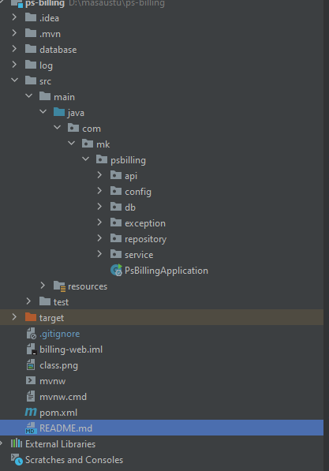

- Java 17
- Spring Framework
- Spring Boot
- Spring MVC
- Spring Data
- Spring Rest (http status)
- Spring Security

<pre>
 Create:
- http://localhost:8080/member/v1/create

 Delete:
- http://localhost:8080/member/v1/{id}

Update:
- http://localhost:8080/member/v1/update/{id}

Find:
- http://localhost:8080/member/v1/{id}

Find Code
- http://localhost:8080/member/v1/code/{code}

Get All:
- http://localhost:8080/member/v1/all
</pre>

### Class Diagram

### Project Structure
