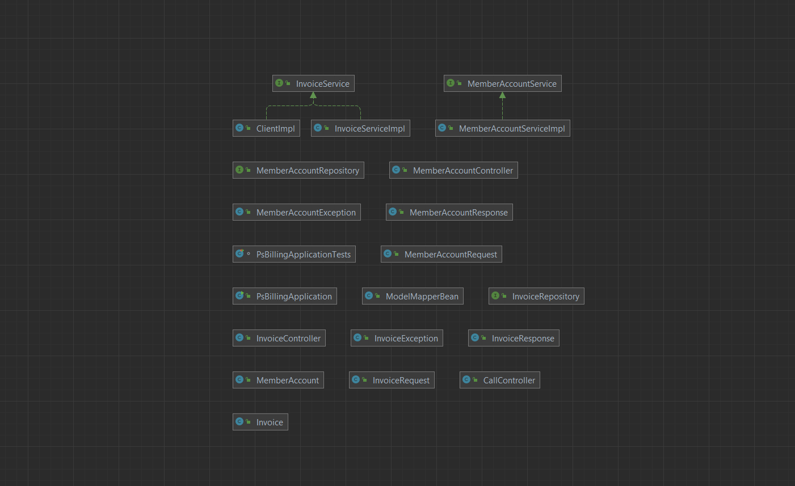

- Java 17
- Spring Framework
- Spring Boot
- Spring MVC
- Spring Data
- Spring Rest (http status)

 <h1>Member Account</h1>
<pre>

    Create:
    - http://localhost:8080/member/v1/create

    Delete:
    - http://localhost:8080/member/v1/delete/{id}

    Update:
    - http://localhost:8080/member/v1/update/{id}

    GET:
    - http://localhost:8080/member/v1/{id}

    Find Code
    - http://localhost:8080/member/v1/code/{code}

    Get All:
    - http://localhost:8080/member/v1/all
</pre>

 <h1>Invoice</h1>
<pre>

    Create:
    - http://localhost:8080/invoice/v1/create

    Delete:
    - http://localhost:8080/invoice/v1/delete/{id}

    Update:
    - http://localhost:8080/invoice/v1/update/{id}

    GET:
    - http://localhost:8080/invoice/v1/{id}

    Get All:
    - http://localhost:8080/invoice/v1/all

    Make Payment :
    - http://localhost:8080/invoice/v1/payment/{invoiceType}/{memberCode}/{amount}

    Inquire Payment:
    - http://localhost:8080/invoice/v1/inquire/{invoiceType}/{memberCode}

    Cancel Payment:
    - http://localhost:8080/invoice/v1/cancel/{invoiceType}/{memberCode}/{amount}
</pre>

### Class Diagram

### Project Structure
